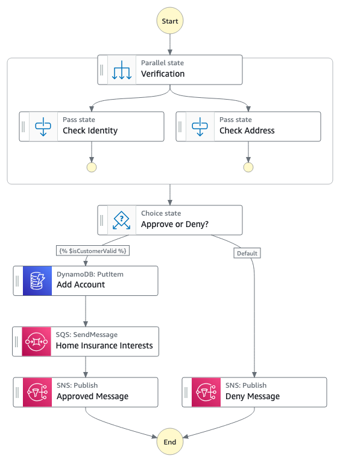

# How to use variables and JSONata in Step Functions

This application shows how to build a Standard or an Express Step Functions workflow by writing minimal code and leveraging variables and JSONata. [JSONata](https://docs.jsonata.org/overview.html) is a lightweight query and transformation language for JSON data. Inspired by the 'location path' semantics of XPath 3.1, it allows sophisticated queries to be expressed in a compact and intuitive notation.

## Application Use Case
The example application used in this case is based on insurance domain. New customers shop for insurances and apply for a new account providing their basic information and their interests in the types of insurances (home, auto, boat, etc).

The information provided by an insurance customer is taken as an input to this Step Functions workflow. Step Function is responsible for doing below operations on the input payload in this order:

1. Verify identity of the user
2. Verify address of the user
3. Approve the new account application if above checks pass
4. Deny the new account application if any of the above checks fail
5. Upon approval:
  a. insert user information in DynamoDB Accounts Table
  b. check "home" insurance interests and put them in a queue to be processed by a different application
  c. send an email notification to user about application approval
6. Upon deny:
  a. send an email notification to user about application denial

### How does it look in Step Functions


Now, this Step Function can be a standard workflow or an express workflow according to your need. What we are going to look at is the flexibility of handling payload across state transitions.

Here is a sample payload:

```json
{
  "data": {
    "firstname": "Jane",
    "lastname": "Doe",
    "identity": {
      "email": "jdoe@example.com",
      "ssn": "123-45-6789"
    },
    "address": {
      "street": "123 Main St",
      "city": "Columbus",
      "state": "OH",
      "zip": "43219"
    },
    "interests": [
      {"category": "home", "type": "own", "yearBuilt": 2004, "estimatedValue": 800000 },
      {"category": "auto", "type": "car", "yearBuilt": 2012, "estimatedValue": 7000 },
      {"category": "boat", "type": "snowmobile", "yearBuilt": 2020, "estimatedValue": 25000 },
      {"category": "auto", "type": "motorcycle", "yearBuilt": 2018, "estimatedValue": 15000 },
      {"category": "auto", "type": "RV", "yearBuilt": 2015, "estimatedValue": 102000 },
      {"category": "home", "type": "business", "yearBuilt": 2009, "estimatedValue": 600000 }
    ]
  }
}
```

The actual insurance logic for new user account application may be different and sophisticated but for the sake of simplicity we are considering the above payload which has `data` about the new user and user's `interests` in the types of insurance from the insurance provider.

Refer this [AWS Compute Blog]() for detailed explanations.

## Deploy the application
To build and deploy your application for the first time, run the following in your shell:

```bash
sam build && sam deploy --guided
```

Subsequent build and deploys can just be:
```bash
sam build && sam deploy
```

## Run the application
To run the application, use below aws cli command. Replace the state machine arn from the output of deployment steps above.

```bash
aws stepfunctions start-execution \
  --state-machine-arn <YourStepFunctionArnHere> \
  --input "{\"data\":{\"firstname\":\"Jane\",\"lastname\":\"Doe\",\"identity\":{\"email\":\"jdoe@example.com\",\"ssn\":\"123-45-6789\"},\"address\":{\"street\":\"123 Main St\",\"city\":\"Columbus\",\"state\":\"OH\",\"zip\":\"43219\"},\"interests\":[{\"category\":\"home\",\"type\":\"own\",\"yearBuilt\":2004,\"estimatedValue\":800000},{\"category\":\"auto\",\"type\":\"car\",\"yearBuilt\":2012,\"estimatedValue\":7000},{\"category\":\"boat\",\"type\":\"snowmobile\",\"yearBuilt\":2020,\"estimatedValue\":25000},{\"category\":\"auto\",\"type\":\"motorcycle\",\"yearBuilt\":2018,\"estimatedValue\":15000},{\"category\":\"auto\",\"type\":\"RV\",\"yearBuilt\":2015,\"estimatedValue\":102000},{\"category\":\"home\",\"type\":\"business\",\"yearBuilt\":2009,\"estimatedValue\":600000}]}}"
```

## Cleanup

To delete the sample application that you created, use the AWS CLI. Assuming you used your project name for the stack name, you can run the following:

```bash
sam delete
```
