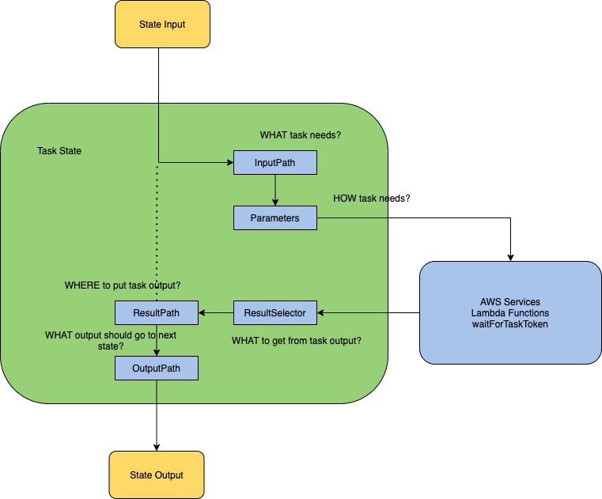

# How to use JSON Path in Step Functions

This application shows how to build a Standard or an Express Step Functions workflow by writing minimal code and leveraging JSONPath. [JSONPath](https://goessner.net/articles/JsonPath/) is XPath for JSON. We will see in detail how JSONPath helps while developing Step Functions.

## Application Use Case
The example application used in this case is based on insurance domain. New customers shop for insurances and apply for a new account providing their basic information and their interests in the types of insurances (home, auto, boat, etc).

The information provided by an insurance customer is taken as an input to this Step Functions workflow. Step Function is responsible for doing below operations on the input payload in this order:

1. Verify identity of the user
2. Verify address of the user
3. Approve the new account application if above checks pass
4. Deny the new account application if any of the above checks fail
5. Upon approval:
  a. insert user information in DynamoDB Accounts Table
  b. check "home" insurance interests and put them in a queue to be processed by a different application
  c. send an email notification to user about application approval
6. Upon deny:
  a. send an email notification to user about application denial

### How does it look in Step Functions


Now, this Step Function can be a standard workflow or a synchronous express workflow according to your need. What we are going to look at is the flexibility of handling payload across state transitions.

Here is a sample payload:

```json
{
  "data": {
    "firstname": "Jane",
    "lastname": "Doe",
    "identity": {
      "email": "jdoe@example.com",
      "ssn": "123-45-6789"
    },
    "address": {
      "street": "123 Main St",
      "city": "Columbus",
      "state": "OH",
      "zip": "43219"
    },
    "interests": [
      {"category": "home", "type": "own", "yearBuilt": 2004 },
      {"category": "auto", "type": "car", "yearBuilt": 2012 },
      {"category": "boat", "type": "snowmobile", "yearBuilt": 2020 },
      {"category": "auto", "type": "motorcycle", "yearBuilt": 2018 },
      {"category": "auto", "type": "RV", "yearBuilt": 2015 },
      {"category": "home", "type": "business", "yearBuilt": 2009 }
    ]
  }
}
```

The actual insurance logic for new user account application may be different and sophisticated but for the sake of simplicity we are considering the above payload which has `data` about the new user and user's `interests` in the types of insurance from the insurance provider

Before we jump into the State Machine, let's look at how Step Functions use JSONPath for the Paths that are natively available in Step Functions

### Paths in Step Function


The main fields that filter and control the flow from state to state in Amazon States Language are:

 - `InputPath` Determines "WHAT" a task needs as input
 - `Parameters` Determines "HOW" the input should look like before invoking the task
 - `ResultSelector` Determines "WHAT to choose" from task's output
 - `ResultPath` Determines "WHERE to put" the chosen task's output
 - `OutputPath` Determines "WHAT to send to next" state

The key thing to focus here is that downstream states depend on what their previous states provide/feed them with.

Let's take the sample payload shown above and apply those paths. You can do the same with [Data flow Simulator present in Step Functions AWS Console](https://us-east-2.console.aws.amazon.com/states/home?region=us-east-2#/simulator):

`"InputPath": '$.data.address'` makes below JSON available as input for the task
```json
{
  "street": "123 Main St",
  "city": "Columbus",
  "state": "OH",
  "zip": "43219"
}
```
`Parameters` are applied after `InputPath` which is used as a mechanism as to HOW the underlying task accepts its input payload. For example, in the below example `Parameters` receive the payload that has been provided by `InputPath` above and then applies an intrinsic function `States.Format` on the payload items to create a string as shown below.

```json
"Parameters": {
  "addressString.$": "States.Format('{}, {} - {}', $.city, $.state, $.zip)"
}
```

```json
{
  "addressString": "Columbus, OH - 43219"
}
```

The underlying task (Lambda or DDB or SQS or SNS , etc) might be accepting a parameter `addressString` instead of an address json object. Here, `Parameters` provide the capability to focus on "HOW" the input should look like before invoking the task.

Once the task is invoked, let's assume that this is an AWS Lambda integration, which validates the address and returns the output payload as address approved and would look something like this:

```json
{
  "ExecutedVersion": "$LATEST",
  "Payload": {
    "statusCode": "200",
    "body": "{\"approved\": true}"
  },
  "SdkHttpMetadata": {
    "HttpHeaders": {
      "Connection": "keep-alive",
      "Content-Length": "43",
      "Content-Type": "application/json",
      "Date": "Thu, 16 Apr 2020 17:58:15 GMT",
      "X-Amz-Executed-Version": "$LATEST",
      "x-amzn-Remapped-Content-Length": "0",
      "x-amzn-RequestId": "88fba57b-adbe-467f-abf4-daca36fc9028",
      "X-Amzn-Trace-Id": "root=1-5e989cb6-90039fd8971196666b022b62;sampled=0"
    },
    "HttpStatusCode": 200
  },
  "SdkResponseMetadata": {
    "RequestId": "88fba57b-adbe-467f-abf4-daca36fc9028"
  },
  "StatusCode": 200
}
```

Now, this Address validation approval has to be provided to the downstream states for additional business logic. However, the downstream states do not care about anything else other than  `Payload.body` from above json. That is where a combination of intrinsic function and `ResultSelector` becomes useful.

```json
"ResultSelector": {
  "identity.$": "States.StringToJson($.Payload.body)"
}
```

`ResultSelector` is responsible to pickup "WHAT" is needed from the task output. Here it takes the json string `$.Payload.body` and applies `States.StringToJson` to convert string to json and put the json under `identity`

```json
{
  "identity": {
    "approved": true
  }
}
```

Now, the next question will be WHERE should the above result go to in the initial payload so that the downstream states will have access to the actual input payload plus the results from the previous states. That is where `ResultPath` comes into picture.

`ResultPath: "$.results"` informs state machine that any result selected from the task output (actual output if none specified) should go under `results` and `results` should get added to actual incoming payload. Thus, the output from `ResultPath` would look like:

```json
{
  "data": {
    "firstname": "Jane",
    "lastname": "Doe",
    "identity": {
      "email": "jdoe@example.com",
      "ssn": "123-45-6789"
    },
    "address": {
      "street": "123 Main St",
      "city": "Columbus",
      "state": "OH",
      "zip": "43219"
    },
    "interests": [
      ...
    ]
  },
  "results": {
    "identity": {
      "approved": true
    }
  }
}
```

The good thing about above json is not only that it has results from an operation but also that the incoming payload is in tact for downstream business logic consumption.

This pattern ensures that the previous state keeps the payload properly hydrated for the next state.

A good pattern will the follow above until you reach an end state. In this sample app, you would see an end state with a Step output payload like this:

```json
{
  "data": {
    "firstname": "Jane",
    "lastname": "Doe",
    "identity": {
      "email": "jdoe@example.com",
      "ssn": "123-45-6789"
    },
    "address": {
      "street": "123 Main St",
      "city": "Columbus",
      "state": "OH",
      "zip": "43219"
    },
    "interests": [
      ...
    ]
  },
  "results": {
    "addressResult": {
      "approved": true,
      "message": "address validation passed"
    },
    "identityResult": {
      "approved": true,
      "message": "identity validation passed"
    },
    "accountAddition": {
      "statusCode": 200
    },
    "homeInsuranceInterests": {
      "statusCode": 200
    },
    "sendApprovedNotification": {
      "statusCode": 200
    }
  }
}
```

but in an ideal state scenario you would not want to send the input payload back to the caller of the step function. That is where you have the opportunity to use `OutputPath` which will just send the response or the results that acts as a response from the service

`"OutputPath": "$.results"` would yield

```json
{
  "addressResult": {
    "approved": true,
    "message": "address validation passed"
  },
  "identityResult": {
    "approved": true,
    "message": "identity validation passed"
  },
  "accountAddition": {
    "statusCode": 200
  },
  "homeInsuranceInterests": {
    "statusCode": 200
  },
  "sendApprovedNotification": {
    "statusCode": 200
  }
}
```

Now, think of a Synchronous Express Workflow and the workflow sending above response back to caller. Less noise, more fine grained response

### Advanced JSON Path
Let's check an advanced JSON path scenario. For this lets pick up the interests from the input payload. The state machine in this sample app focuses on filtering out `interests` of category `home`. In a real enterprise scenario, it makes lot of sense. Home insurance can be a different Business Unit than Auto or Boat insurance. Using advanced JSONPath, we can filter out `home` specific interests and either call a home insurance service, or put event on home insurance event bus using EventBridge, or put all home related interest in an `HomeInterestsQueue` where independent consumer applications can poll and work on it. 

This what this sample app has as `Home Insurance Interests` state:

```json
...
"Home Insurance Interests": {
  "Type": "Task",
  "Resource": "arn:aws:states:::sqs:sendMessage",
  "InputPath": "$..interests[?(@.category==home)]",
  "Parameters": {
    "QueueUrl": "${HomeInsuranceInterestQueueArn}",
    "MessageBody.$": "$"
  },
  "ResultSelector": {
    "statusCode.$": "$.SdkHttpMetadata.HttpStatusCode"
  },
  "ResultPath": "$.results.homeInsuranceInterests",
  "Next": "Approved Message"
}
...
```

`"InputPath": "$..interests[?(@.category==home)]"` filters all `home` insurance related interests 

```json
[
  {
    "category": "home",
    "type": "own",
    "yearBuilt": "2004",
    "estimatedValue": "300000"
  },
  {
    "category": "home",
    "type": "business",
    "yearBuilt": "2009",
    "estimatedValue": "450000"
  }
]
```

and adds the array as a message in an SQS Queue. 


It uses advanced JSONPath with `$..` notation and `[?(@.category==home)]` filters.

Additional, information on JSONPath can be found [here](https://goessner.net/articles/JsonPath/)

This filtering is not just applicable to `home` insurance interests but can be extended similarly to other categories and other business logic

## Other Resources
In addition to this sample app and notes above, please also take a look at [the blog on Data flow Simulator](https://aws.amazon.com/blogs/compute/modeling-workflow-input-output-path-processing-with-data-flow-simulator/)

## Deploy the application
To build and deploy your application for the first time, run the following in your shell:

```bash
sam build && sam deploy --guided
```

Subsequent build and deploys can just be:
```bash
sam build && sam deploy
```

## Run the application
To run the application, use below aws cli command. Replace the state machine arn from the output of deployment steps above.

```bash
aws stepfunctions start-execution \
  --state-machine-arn <YourStepFunctionArnHere> \
  --input "{\"data\":{\"firstname\":\"Jane\",\"lastname\":\"Doe\",\"identity\":{\"email\":\"jdoe@example.com\",\"ssn\":\"123-45-6789\"},\"address\":{\"street\":\"123 Main St\",\"city\":\"Columbus\",\"state\":\"OH\",\"zip\":\"43219\"},\"interests\":[{\"category\":\"home\",\"type\":\"own\",\"yearBuilt\":2004},{\"category\":\"auto\",\"type\":\"car\",\"yearBuilt\":2012},{\"category\":\"boat\",\"type\":\"snowmobile\",\"yearBuilt\":2020},{\"category\":\"auto\",\"type\":\"motorcycle\",\"yearBuilt\":2018},{\"category\":\"auto\",\"type\":\"RV\",\"yearBuilt\":2015},{\"category\":\"home\",\"type\":\"business\",\"yearBuilt\":2009}]}}"
```

## Cleanup

To delete the sample application that you created, use the AWS CLI. Assuming you used your project name for the stack name, you can run the following:

```bash
sam delete
```